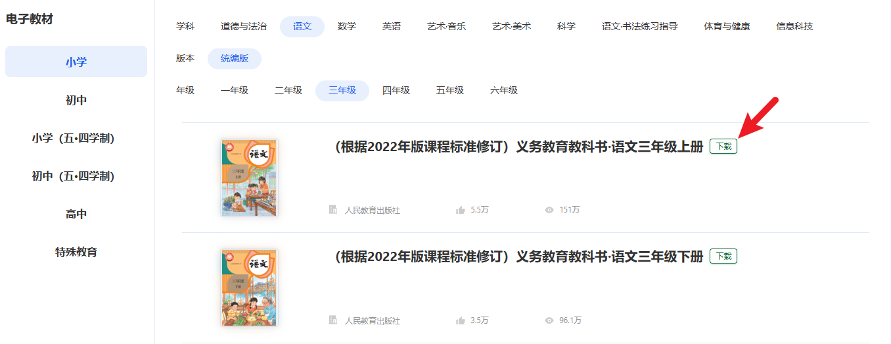

# 国家中小学智慧教育平台电子教材下载扩展

适用于 Chromium 内核浏览器（如 Google Chrome、Microsoft Edge 等）的扩展插件。
支持在国家中小学智慧教育平台（[smartedu.cn](https://basic.smartedu.cn)）的教材列表页与详情页直接下载官方原版 PDF 电子教材。

扩展自动在平台教材列表页（`/tchMaterial`、`/elecEdu`）及阅读详情页（`/detail`）的教材标题旁注入“下载”按钮；下载时自动从元数据维度（`zxxbb`）中解析教材所属真实版本（如统编版、人教版、北师大版、苏教版等，注意此项为课程教材版本，而非出版单位信息），并将文件统一规范命名为 `[版本] 官方完整教材名称.pdf`。

<p align="center">
  <a href="./screenshot-1.png" target="_blank" title="点击查看原图大图">
    
  </a>
  <br>
  <sub>图 1：教材列表页下载效果（点击图片可放大查看原图）</sub>
</p>

<p align="center">
  <a href="./screenshot-2.png" target="_blank" title="点击查看原图大图">
    
  </a>
  <br>
  <sub>图 2：教材详情页下载效果（点击图片可放大查看原图）</sub>
</p>

---

## 1. 安装与使用说明

本扩展遵循 **Manifest V3** 规范开发，可通过开发者模式直接加载。

### 步骤 1：安装扩展

#### 获取项目文件
通过 Git 克隆本项目，或点击页面右上角 **Code -> Download ZIP** 下载并解压：
```bash
git clone https://github.com/elmar-chen/smartedu-downloader-extension.git
```

#### Microsoft Edge：
1. 在地址栏输入并打开：`edge://extensions/`。
2. 启用页面左侧的 **“开发人员模式”** 开关。
3. 点击顶部的 **“加载解压缩的扩展”** 按钮。
4. 在弹出的文件选择器中，选择解压后的项目根目录（即包含 `manifest.json` 的文件夹）。
5. 点击“选择文件夹”完成加载。

#### Google Chrome：
1. 在地址栏输入并打开：`chrome://extensions/`。
2. 启用页面右上角的 **“开发者模式”**（Developer mode）开关。
3. 点击左上角的 **“加载已解压的扩展程序”**（Load unpacked）按钮。
4. 选择解压后的项目根目录完成加载。

---

### 步骤 2：下载教材

1. **登录平台**：
   - 访问 [国家中小学智慧教育平台](https://basic.smartedu.cn/) 并登录个人账号。
   - 说明：登录后浏览器本地存储才会保存用于生成签名的凭据信息。
2. **在列表页下载**：
   - 进入教材列表页：[https://basic.smartedu.cn/tchMaterial](https://basic.smartedu.cn/tchMaterial) 或 [https://basic.smartedu.cn/elecEdu](https://basic.smartedu.cn/elecEdu)。
   - 页面加载后，各条目名称后方会自动显示绿色的“下载”按钮（见图 1），点击后自动计算签名并发起下载。
3. **在详情页下载**：
   - 进入教材详情页（如 `https://basic.smartedu.cn/tchMaterial/detail?contentType=assets_document&contentId=...`）。
   - 在页面顶部标题区域会注入“下载”按钮（见图 2），点击即可下载。
4. **下载文件存储**：
   - 文件默认保存于系统的下载目录中：`SmartEdu教材/[版本] 教材名称.pdf`。

---

## 2. 平台资源组织与鉴权机制

平台采用元数据公开托管与私有资源签名鉴权分离的架构：

```
                      +----------------------------------------------------+
                      |    国家中小学智慧教育平台 (basic.smartedu.cn)      |
                      +----------------------------------------------------+
                                                |
                +--------------------------------+--------------------------------+
                |                                                                 |
                v                                                                 v
+------------------------------------+                         +-----------------------------------+
|  1. 公开元数据层 (Public CDN)      |                         |  2. 私有资源层 (Protected CDN)    |
|  - 目录索引分片 (part_100~103)     |                         |  - 原版 PDF 课本文件              |
|  - 分类维度树 (tch_material_tag)   |                         |  - 域名: r2-ndr-private.ykt...   |
|  - 教材元数据 (details/{id})       |                         |  - 鉴权: 必须附带 x-nd-auth 头    |
+------------------------------------+                         +-----------------------------------+
                |                                                                 ^
                | (解析资产路径与 ID)                                             | (附带签名发起 GET 请求)
                +-----------------------------------------------------------------+
                                                |
                                       +--------------------+
                                       | 3. x-nd-auth 签名  |
                                       | HMAC-SHA256(Nonce) |
                                       +--------------------+
```

---

### 2.1 公开元数据层（无需登录）

平台教材的基础元数据以静态 JSON 形式托管在 CDN 服务上：

1. **全量目录分片索引**：
   - **版本标识**：`https://s-file-1.ykt.cbern.com.cn/zxx/ndrs/resources/tch_material/version/data_version.json`
   - **数据分片**（全量 3,565 条原始记录，分片存储）：
     - `https://s-file-1.ykt.cbern.com.cn/zxx/ndrs/resources/tch_material/part_100.json`
     - `https://s-file-1.ykt.cbern.com.cn/zxx/ndrs/resources/tch_material/part_101.json`
     - `https://s-file-1.ykt.cbern.com.cn/zxx/ndrs/resources/tch_material/part_102.json`
     - `https://s-file-1.ykt.cbern.com.cn/zxx/ndrs/resources/tch_material/part_103.json`
2. **多级分类维度树（Tags）**：
   - 接口地址：`https://s-file-1.ykt.cbern.com.cn/zxx/ndrs/tags/tch_material_tag.json`
   - 包含的维度字段：
     - `zxxxd`：学段（小学、初中、高中、特殊教育等）
     - `zxxxk`：学科（语文、数学、英语、物理、化学、道德与法治等）
     - `zxxbb`：版本（统编版、人教版、北师大版、苏教版、冀教版等；`provider` 字段仅表示出版单位）
     - `zxxnj`：年级（一年级至高三年级）
     - `zxxcc`：册次（上册、下册、全一册、必修等）

---

### 2.2 私有资源鉴权协议 (`x-nd-auth`)

平台 PDF 资源存放于受保护的对象存储服务中：
```text
https://r2-ndr-private.ykt.cbern.com.cn/edu_product/esp/assets/{book_id}.pkg/{filename}.pdf
```
未附带合法鉴权信息的 HTTP 请求将被服务器拦截并返回 `401 Unauthorized` 或 `403 Forbidden`。

客户端请求需在 HTTP 标头中携带 `x-nd-auth` 字段：
```http
x-nd-auth: MAC id="{access_token}",nonce="{nonce}",mac="{mac}"
```

#### 鉴权签名计算流程：

1. **获取客户端凭证**：
   - 用户登录后，认证中心在浏览器的 `localStorage` 中存入会话凭证（键名如 `ND_UC_AUTH-...&ncet-xedu&token`）。
   - 提取以下两个字段：
     - `access_token`：用户会话标识。
     - `mac_key`：对称加密密钥。
2. **生成 Nonce 字符串**：
   - 格式：`<13位毫秒时间戳>:<8位随机大写字母与数字>`
   - 示例：`1789700788926:1GEOUXMG`
3. **构造规范化待签字符串（Normalized Message）**：
   按照以下 4 行格式拼接（每行以 `\n` 换行符结尾）：
   ```text
   <nonce>\n
   <HTTP_METHOD>\n
   <URL相对路径及Query参数(经URL编码)>\n
   <目标Host>\n
   ```
   *待签内容示例*：
   ```text
   1789700788926:1GEOUXMG
   GET
   /edu_product/esp/assets/bdc00134-465d-454b-a541-dcd0cec4d86e.pkg/book.pdf
   r2-ndr-private.ykt.cbern.com.cn
   
   ```
4. **计算 MAC 签名**：
   - 使用 `mac_key` 作为密钥，对待签字符串执行 `HMAC-SHA256` 运算。
   - 对运算结果进行 Base64 编码，生成最终的 `mac` 字符串。

#### 签名算法代码实现示例：

##### 示例 1：JavaScript（Web Crypto API）
```javascript
/**
 * 使用 Web Crypto API 计算 HMAC-SHA256 签名 (Base64 输出)
 * @param {string} macKey    - 从 localStorage 提取的 mac_key 密钥
 * @param {string} message   - 严格遵循规范拼接的待签字符串 (带 4 个换行符)
 * @returns {Promise<string>} Base64 编码的 mac 签名
 */
async function hmacSha256(macKey, message) {
  const enc = new TextEncoder();
  const keyData = enc.encode(macKey);
  const msgData = enc.encode(message);

  const cryptoKey = await window.crypto.subtle.importKey(
    'raw',
    keyData,
    { name: 'HMAC', hash: 'SHA-256' },
    false,
    ['sign']
  );

  const signatureBuffer = await window.crypto.subtle.sign('HMAC', cryptoKey, msgData);
  const bytes = new Uint8Array(signatureBuffer);
  let binaryStr = '';
  for (let i = 0; i < bytes.byteLength; i++) {
    binaryStr += String.fromCharCode(bytes[i]);
  }
  return btoa(binaryStr);
}

// 构造请求头示例
async function buildAuthHeader(urlStr, method, accessToken, macKey) {
  const u = new URL(urlStr);
  const relativePath = encodeURI(decodeURI(u.pathname)) + (u.search || '');
  const authority = u.host;
  
  const nonce = `${Date.now()}:${Math.random().toString(36).substring(2, 10).toUpperCase()}`;
  const message = `${nonce}\n${method.toUpperCase()}\n${relativePath}\n${authority}\n`;
  
  const mac = await hmacSha256(macKey, message);
  return `MAC id="${accessToken}",nonce="${nonce}",mac="${mac}"`;
}
```

##### 示例 2：Python（标准库实现）
```python
import hmac
import hashlib
import base64
import time
import random
import string
from urllib.parse import urlparse, quote, unquote

def calculate_mac(mac_key: str, message: str) -> str:
    key_bytes = mac_key.encode('utf-8')
    msg_bytes = message.encode('utf-8')
    signature = hmac.new(key_bytes, msg_bytes, hashlib.sha256).digest()
    return base64.b64encode(signature).decode('utf-8')

def build_auth_header(url: str, method: str, access_token: str, mac_key: str) -> str:
    parsed = urlparse(url)
    safe_path = quote(unquote(parsed.path))
    relative = f"{safe_path}?{parsed.query}" if parsed.query else safe_path
    host = parsed.netloc

    nonce_time = int(time.time() * 1000)
    rand_str = ''.join(random.choices(string.ascii_uppercase + string.digits, k=8))
    nonce = f"{nonce_time}:{rand_str}"

    message = f"{nonce}\n{method.upper()}\n{relative}\n{host}\n"
    mac = calculate_mac(mac_key, message)
    return f'MAC id="{access_token}",nonce="{nonce}",mac="{mac}"'
```

---

## 3. 平台数据实体拓扑与元数据架构

平台教材条目并非单一片结构，而是包含两类资源形态以及三层节点拓扑。

### 3.1 两类资源形态 (Resource Code Types)

平台条目通过 `resource_type_code` 进行区分：

1. **普通电子教材（3,240 本）**：
   - **类型代码**：`resource_type_code: "assets_document"`（普通单文档教材）。
   - **元数据接口**：
     ```text
     https://s-file-2.ykt.cbern.com.cn/zxx/ndrv2/resources/tch_material/details/{id}.json
     ```
     （备用镜像：`s-file-1.ykt.cbern.com.cn`）。
   - **数据结构**：包含 `ti_items` 数组，内部包含文档切片预览与 PDF 文件的下载链接。

2. **特殊专题 / 特殊教育教材（325 本）**：
   - **类型代码**：`resource_type_code: "thematic_course"`（复合专题课程节点，包含部分地质出版社版本课程、盲校聋校等特殊教育教材，如 `4fab8ab2-b46c-77e0-80ef-8b233bfcc449`）。
   - **寻址特征**：
     - 该类条目未生成 `tch_material/details/{id}.json`（若直接请求将返回 HTTP 403）。
     - 资源清单托管于专题资源列表路径：
       ```text
       https://s-file-1.ykt.cbern.com.cn/zxx/ndrs/special_edu/thematic_course/{id}/resources/list.json
       ```
     - 实际 PDF 资源挂载于该专题下属子节点的资源列表中。

---

### 3.2 节点的三层拓扑结构与寻址机制

平台全量 3,565 个条目在层级关系上分为以下三类节点：

```
[ 全量目录 3,565 本条目 ]
       │
       ├─── 1. 普通独立教材 (2,586 本)
       │       └── 属性: compound_node 不存在或为 normal
       │       └── 寻址: tch_material/details/{id}.json
       │       └── 标签: tag_list 完整自带
       │
       ├─── 2. 复合课程父节点 (325 本)
       │       └── 属性: resource_type_code: thematic_course
       │       └── 寻址: thematic_course/{id}/resources/list.json
       │       └── 标签: 拥有完备的学段/学科/版本标签
       │
       └─── 3. 复合课程子节点 (654 本)
               └── 属性: "compound_node": "sub"
               └── 外键: "teachmeterial_ids": ["<父节点UUID>"]
               └── 寻址: 未单独提供 details/{id}.json (直接请求返回 403)
               └── 真实附件: 挂载在父节点 resources/list.json 中
               └── 标签: tag_list: [] 为空，继承自父节点
```

#### 拓扑与寻址规则说明：

1. **复合课程子节点寻址机制**：
   - 官方分片中有 654 本教材标记为 `"compound_node": "sub"`。
   - **403 响应成因**：平台未为这些子节点单独生成 `details/{id}.json` 静态文件。若直接以子节点 ID 请求该路径，CDN 返回 HTTP 403。
   - **寻址方式**：通过子节点的 `teachmeterial_ids[0]` 读取父节点 ID，请求父节点专题列表 `thematic_course/{parent_id}/resources/list.json`，并从中提取挂载在对应子节点下的 PDF 文件。
2. **标签继承规则**：
   - 复合课程子节点的 `tag_list` 字段默认为空数组 `[]`。
   - 平台的分类属性（学段 `zxxxd`、学科 `zxxxk`、版本 `zxxbb` 等）统一归集于父节点。在解析子节点时，若 `tag_list` 为空，需溯源至父节点提取对应标签。
3. **复合包内附件筛选**：
   - 部分复合课程包挂载了多种类型的教学资源（如 `.pptx`、`.docx`、`.mp4` 等）。
   - 提取附件时需对 `ti_format === "pdf"` 进行筛选，并优先选择 `ti_file_flag === "source"`（或按文件大小排序）获取主体课本文件。

---

## 4. 数据特征与边界处理规则

### 4.1 目录分片中的历史冗余条目 (Tombstones)
- **特征**：在平台目录分片（`part_100.json` ~ `part_103.json`）的 3,565 条记录中，有 3 条记录在请求详情接口时返回 HTTP 404。
- **成因**：该 3 项记录（`c63585f4-0742-4429-b712-1cec38a36b44`、`2d71444e-c469-4c41-9eb9-23475f9d49e1`、`1aa22b98-f559-4f48-b21a-238e52d71374`）为历史草稿或已被新课标修订版替代的条目。由于目录分片采用静态批量导出，历史记录未被物理清理，形成冗余。
- **处理方案**：以详情接口可用性校验为准过滤失效条目。平台当前有效教材总数为 **3,561 本**。

### 4.2 非 PDF 媒体课程条目
- **特征**：部分有效教材条目能够正常获取详情，但其资源列表中不包含 PDF 文件（例如部分实操类科目的演示视频课程，ID: `19452c79-4fea-4f74-c252-89b00a418411`）。
- **成因**：该类条目仅包含教学示范视频（`ti_format: "mp4"`），未提供电子教材文档。
- **处理方案**：解析器在提取附件时应先判断是否存在 `ti_format === "pdf"`，避免预设所有条目均包含 PDF。

### 4.3 母版与转码文件双轨存储
- **特征**：同一教材条目中常同时包含两项及以上 PDF 附件，且文件体积不同。
- **成因**：平台通常同时保留出版机构上传的原版 PDF（`ti_file_flag: "source"`，保留高分辨率矢量图形与印刷品质，通常在 30MB~150MB）与平台压缩转码版（`ti_file_flag: "transcode"`，供在线预览使用）。
- **处理方案**：下载时优先选取 `ti_file_flag === "source"` 的文件；若未作标识，则按 `ti_size` 选取文件体积较大者。

### 4.4 动态路径占位符解析与域名容灾 (`cs_path:${ref-path}`)
- **特征**：部分条目的下载 URL 包含 `cs_path:${ref-path}/edu_product/esp/assets/...`。
- **成因**：平台使用路径占位符实现对象存储路径映射与平滑迁移。`${ref-path}` 在运行时解析为受保护的存储服务域名：`https://r2-ndr-private.ykt.cbern.com.cn`（或同构镜像域）。
- **处理方案**：解析逻辑中需将 `cs_path:${ref-path}` 替换为有效基准域名；元数据请求时可在 `s-file-1` 与 `s-file-2` 之间实现故障切换。

### 4.5 文件名字符合法性转义
- **特征**：教材官方标题可能包含半角冒号 `:`、斜杠 `/` 或引号 `"` 等字符。不同操作系统文件系统（如 Windows NTFS/FAT32、Linux/macOS）对文件名字符存在限制。直接传入非法字符会导致浏览器下载接口报错。
- **处理方案**：提取文件名后，将保留字符（`\ / : * ? " < > |`）统一替换为下划线 `_`，并对重复的前缀作去重处理。

---

## 5. 下载实现流程与状态机

实现独立下载脚本或自动化工具时，可参考以下标准化处理流程：

```
[ 输入: 教材 book_id ]
         │
         ▼
[ 步骤 1: 确定元数据请求路径 ]
   ├── 路径 A: GET https://s-file-2.ykt.cbern.com.cn/zxx/ndrv2/resources/tch_material/details/{book_id}.json
   └── 路径 B: (若路径 A 返回 403/404 或属于复合子节点)
         GET https://s-file-1.ykt.cbern.com.cn/zxx/ndrs/special_edu/thematic_course/{parent_id}/resources/list.json
         │
         ▼
[ 步骤 2: 解析分类标签 (Tag Resolution) ]
   ├── 从条目自身的 tag_list 提取各维度属性:
   │     zxxxd -> 学段 (如: 小学)
   │     zxxxk -> 学科 (如: 道德与法治)
   │     zxxbb -> 版本 (如: 统编版)
   │     zxxnj -> 年级 (如: 一年级)
   │     zxxcc -> 册次 (如: 上册)
   └── 若 tag_list 为空 -> 依据 teachmeterial_ids[0] 溯源并继承父节点标签
         │
         ▼
[ 步骤 3: 提取与筛选 PDF 附件 (Attachment Extraction) ]
   ├── 遍历 ti_items 列表，过滤出 ti_format === 'pdf'
   ├── 还原路径: 将 cs_path:${ref-path} 替换为 https://r2-ndr-private.ykt.cbern.com.cn
   └── 选择策略: 优先选取 ti_file_flag === "source"，其次按 ti_size 降序取最大者
         │
         ▼
[ 步骤 4: 生成鉴权请求头 (Authentication Header) ]
   ├── 生成 Nonce: Date.now() + ":" + randomString(8)
   ├── 拼接待签串: Message = nonce + "\nGET\n" + url_path_query + "\n" + host + "\n"
   ├── 计算签名: Mac = Base64( HMAC_SHA256(mac_key, Message) )
   └── 构造请求头: x-nd-auth: MAC id="{access_token}",nonce="{nonce}",mac="{Mac}"
         │
         ▼
[ 步骤 5: 文件命名与保存 (Safe File Persistence) ]
   ├── 格式化文件名: formatted = `[${zxxbb}] ${title}`
   ├── 字符安全替换: filename = formatted.replace(/[\\/:*?"<>|]/g, '_') + ".pdf"
   └── 发起请求: 携带 x-nd-auth 标头发起 HTTP GET 请求并保存至本地
```

---

## 6. 扩展目录结构

```
extension/
├── manifest.json       # 扩展清单配置 (Manifest V3 规范)
├── content.js          # 页面注入脚本 (DOM 识别、元数据解析、Web Crypto 签名、下载调用)
├── content.css         # 按钮样式与状态交互样式
├── background.js       # 后台 Service Worker (chrome.downloads 下载分发与凭据代理)
├── popup.html          # 扩展弹窗界面
├── popup.js            # 弹窗交互逻辑
├── icons/              # 扩展图标 (16x16, 48x48, 128x128)
├── screenshot-1.png    # 列表页下载效果截图
├── screenshot-2.png    # 详情页下载效果截图
└── README.md           # 项目技术说明文档
```

---

## 7. 免责声明

1. 本项目仅用于前端技术研究、浏览器扩展接口开发学习以及合法学习场景下的课本阅读参考。
2. 所有教材的版权均归属对应出版社（如人民教育出版社、北京师范大学出版社等）及国家中小学智慧教育平台所有。
3. 请勿将下载的内容用于商业用途或非授权分发。
